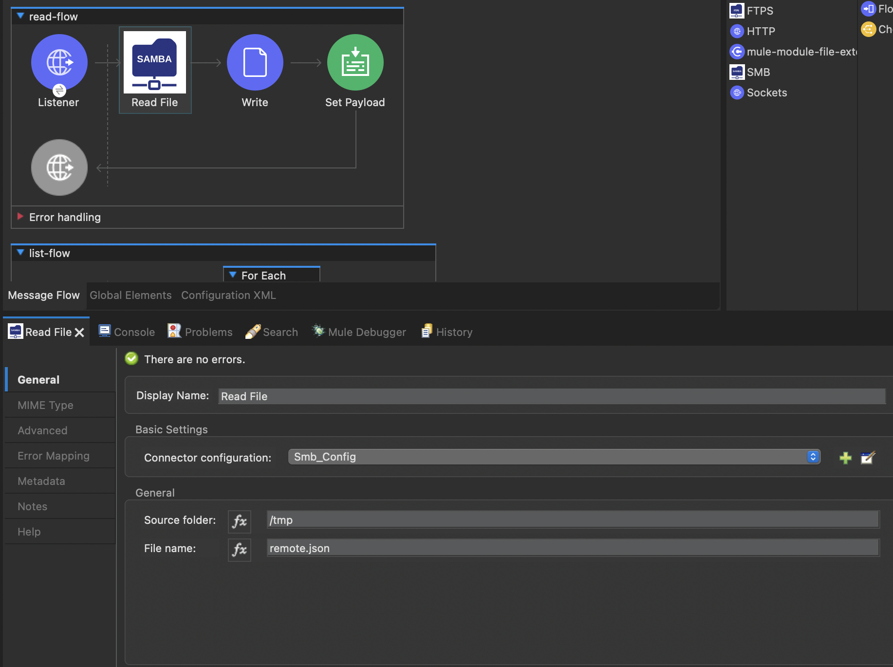
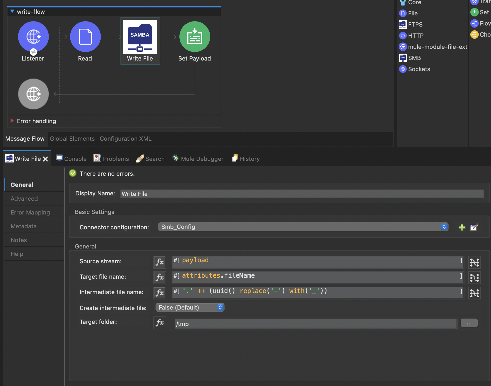
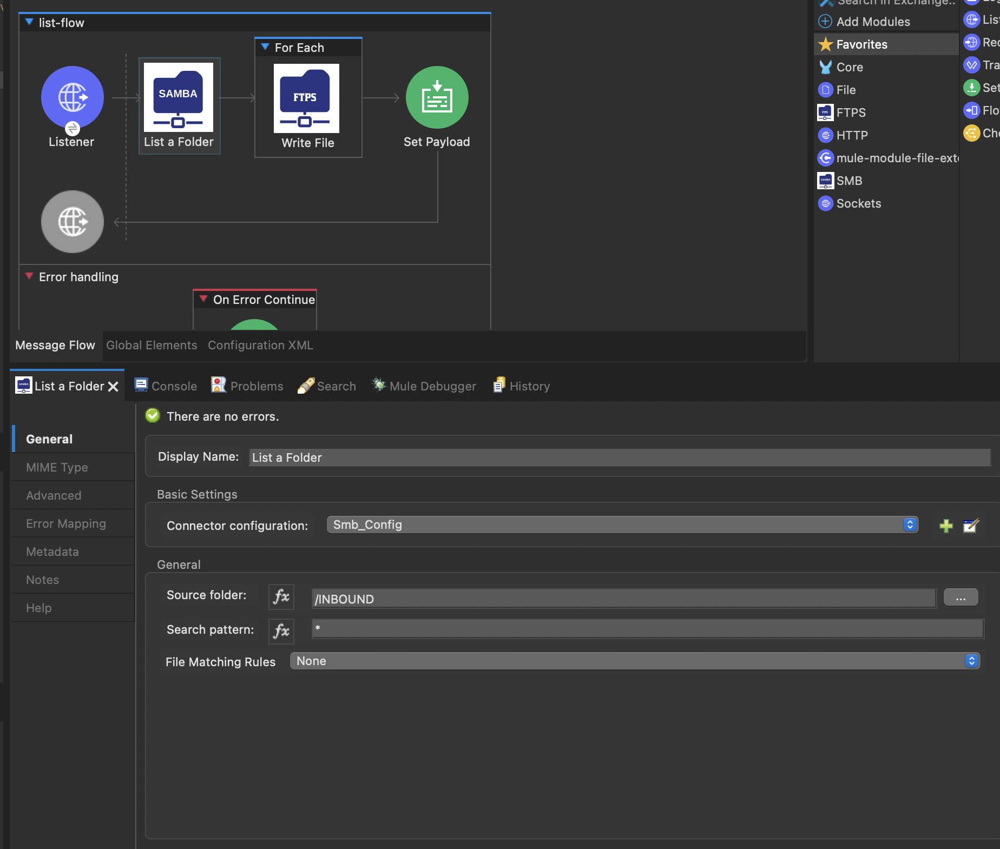

# SMB Connector

### What is SMB/CIFS?
> [From wikipedia](https://en.wikipedia.org/wiki/Server_Message_Block) In computer networking, Server Message Block (SMB), one version of which was also known as Common Internet File System (CIFS /sɪfs/), is a communication protocol for providing shared access to files, printers, and serial ports between nodes on a network. It also provides an authenticated inter-process communication (IPC) mechanism. Most usage of SMB involves computers running Microsoft Windows, where it was known as "Microsoft Windows Network" before the introduction of Active Directory. Corresponding Windows services are LAN Manager Server for the server component, and LAN Manager Workstation for the client component.[4]
All the Windows system share their file system to others using SMB protocol. 

### What is SAMBA
> [From wikipedia](https://en.wikipedia.org/wiki/Samba_(software)): Samba is a free software re-implementation of the SMB networking protocol, and was originally developed by Andrew Tridgell. Samba provides file and print services for various Microsoft Windows clients and can integrate with a Microsoft Windows Server domain, either as a Domain Controller (DC) or as a domain member. As of version 4, it supports Active Directory and Microsoft Windows NT domains.

The SAMBA implementation gives us te flexibility to run SMB server in any supprted system (linux or Mac). 

### SMB / SAMBA Client
MuleSoft is a java based application, so we will require Java `SMB/SAMBA` client library to connect to a network file share using `SMB/SAMBA` protocol. Based on various research, I have found that `smbj` in the most upto date and complete implementation of an SMB client. This connector is based on the most stable version of `smbj` library .

### Available connectors to choose from
As it stands, MuleSoft hasn't created a supported SMB connector, so many in the community came up with their own version of the connector. Following are some of the connectors, I know of:
- [Mule 3 SAMBA Connector](https://github.com/mulesoft-consulting/samba-connector): No longer maintained. No support
- [Apisero Mule 4 SMB Connector](https://anypoint.mulesoft.com/exchange/com.mulesoft.connectors/mule-smb-connector/): Actively Maintained by a MuleSoft partner, Apisero. This is a MuleSoft certified connector, so some initial level of call handling can be done by MuleSoft. Only supports SMBv2 through [smbj 0.10.0](https://github.com/hierynomus/smbj/tree/v0.10.0)
- [Mule 4 SMB Connector](https://github.com/mulesoft-consulting/mule4-smb-connector): Created by a MuleSoft professional service guy. Not supported.

### Why create this connector?
Even though there are many connectors in the market, they do not support all the features I wanted from a connector. Below are some of the features I wanted:
- <b>Actively maintained</b>: Most of the connectors I mentioned are based on older SMB java library. I am keeping my connector upto date with the latest version of the smbj library. This will help me backport all the stability fix, pushed to the upstream.
- <b>Supporting SMBv3</b>: None of the above connectors support `SMBv3`. The current connector is built on `smbj:0.11.3` to support `SMBv3`.
- <b>Streaming</b>: Not all the connectors supports E2E streaming which is vital for microservice architecture.
- <b>Supporting all the operations possible</b>: Wanted to support all the filesystem features avilable through the library.

### User Guide

<b>Build your own</b>
> 1. Clone the [repo](git@github.com:Neo-Integrations/smb-connector.git)
>2. Change to the project directory - `cd smb-connector`
> 3. To install the connector to the local maven repo, run `mvn clean install`.
> 4. Then include the below dependency in your Mule project to start using the connector:
> ```
> <dependency>
>    <groupId>org.neointegrations</groupId>
>    <artifactId>smb-connector</artifactId>
>    <version>1.0.0</version>
>    <classifier>mule-plugin</classifier>
> </dependency>
>    ```
> 5. If you would like to deploy the connector to a maven repo, please include the distribution management in the pom.xml and publish to the maven artifact.

<b>Use the binary directly from maven repo</b>
> 1. First add following maven repository in your pom.xml's repository section
   > ```xml
   > <repositories>
   > ...
   > <repository>
   >  <id>maven-public</id>
   >  <url>https://pkgs.dev.azure.com/NeoIntegration/MuleSoft/_packaging/mvn-public/maven/v1</url>
   >  <releases>
   >     <enabled>true</enabled>
   >  </releases>
   >  <snapshots>
   >     <enabled>true</enabled>
   >  </snapshots>
   > </repository>
   > ...
   > </repositories>
   > ```
> 2. Add following server details in your `$M2_HOME/settings.xml`. Replace `[PERSONAL_ACCESS_TOKEN]` with the actual password. Please [contact](mailto:aminul1983@gmail.com) me if you would like to get a token.
> ```xml
>   <servers>
>   ...
>    <server>
>      <id>maven-public</id>
>      <username>NeoIntegration</username>
>      <password>[PERSONAL_ACCESS_TOKEN]</password>
>    </server>
>    ...
>  </servers>
> ```
> 3. Thats it, you can start using it now.

### How to use the operations

#### Config
First thing first, you will need to create a SMB config. Here is an example of the config:
```xml
<smb:config name="Smb_Config" doc:name="Smb Config" doc:id="89399b2c-0020-4841-91f2-a93977ec9b26">
   <smb:connection host="163.172.147.233" share="users1"  user="example1" password="badpass" port="445" domain="WORKGROUP" timeout="60" socketTimeout="3600">
      <reconnection >
         <reconnect frequency="3000" count="3"/>
      </reconnection>
   </smb:connection>
</smb:config>
```
- `timeout`: Default is `60` seconds. Connection timeout. If the connection is not setup within the timeout seconds, connector will throw timeout error. The unit is `second`.
- `socketTimeout`: Default is `3600` seconds. This applies to socket read timeout. If there is no data read within this period, connector will throw exception. The unit is `second`
- `domain`: Default is `WORKGROUP`. Windows domain. 
- `share`: Default is `sambashare`. The name of the SAMBA share.
- `host`: IP address or domain name of the SMB server.
- `port`: Default port is 445. The port of the SMB server.


#### Read a file


```xml
 <flow name="read-flow" doc:id="1b7e3842-7052-41c9-989a-5fbf34184c3c" >
     <http:listener doc:name="Listener" doc:id="d5e00fe9-b47b-412b-a5aa-bf68b7e862d4" config-ref="HTTP_Listener_config" path="/read"/>
     <smb:read doc:name="Read File" doc:id="3bb9ea7a-9d3b-49a1-8d5c-6f17f397041d" config-ref="Smb_Config" sourceFolder="/tmp" fileName="remote.json"/>
     <file:write doc:name="Write" doc:id="d6e7c48d-052f-40b1-97e2-361e9931eec6" config-ref="File_Config" path="#['tmp/' ++ attributes.name]" />
     <set-payload value="#[true]" doc:name="Set Payload" doc:id="f29a3937-db3b-46b9-8557-817fe8be817f" />
 </flow>
```

#### Write a file

```xml
 <flow name="write-flow" doc:id="a7c8100f-47e3-4441-a8d9-94fb1f921319" >
     <http:listener doc:name="Listener" doc:id="c390a14e-3793-4345-92d9-337661309af9" config-ref="HTTP_Listener_config" path="/write"/>
     <file:read doc:name="Read" doc:id="7fedf28f-0d12-4c2b-9c29-aa13f92ba259" path="tmp/local.json" config-ref="File_Config"/>
     <smb:write doc:name="Write File" doc:id="c6a9e49d-25ed-44bd-b372-adb9c28f9330" config-ref="Smb_Config" targetFolder="/tmp"/>
     <set-payload value="#[true]" doc:name="Set Payload" doc:id="0f348187-1e96-441b-9f74-5edf55570db6" />
 </flow>

```

#### List a folder

```xml

<flow name="list-flow" doc:id="88e4bbb5-0878-4b8b-ada1-7d2eec30fde9" >
     <http:listener doc:name="Listener" doc:id="52218aa5-f53f-4932-b497-6c6bf5ec792a" config-ref="HTTP_Listener_config" path="/list"/>
     <smb:list doc:name="List a Folder" doc:id="1b81fc7d-9903-4154-883b-89e6a2da08de" config-ref="Smb_Config" sourceFolder="/tmp" searchPattern="*"/>
     <foreach doc:name="For Each" doc:id="0c765cba-00ea-420a-bf16-5487ef7a59d1" >
         <file:write doc:name="Write" doc:id="63e110b3-2571-4884-b6a7-8913a956d717" config-ref="File_Config" path="#['tmp/' ++ attributes.name]"/>
     </foreach>
     <set-payload value="#[true]" doc:name="Set Payload" doc:id="d3b060ae-2026-40ca-9be4-fc28e01a5393" />
</flow>
```

#### Remote Copy: Copy a file from one location to another in the remote SMB server

```xml
<flow name="remote-copy-flow" doc:id="d77b7c30-9b8c-4f83-bb64-3fa6571f4c1f" >
   <http:listener doc:name="Listener" doc:id="f5ca8293-19be-48e1-af71-871eb613420b" config-ref="HTTP_Listener_config" path="/rcopy"/>
   <smb:remote-copy doc:name="Remote Copy File" doc:id="1f6869af-7426-4b7b-8e4e-5cf9442ecece" config-ref="Smb_Config" deleteSourceFileAfterRead="false" sourceFolder="/tmp" sourceFileName="remote.json" targetFolder="/" targetFileName="remote.json"/>
</flow>
```

### Advance options

Every operation has few additional settings, which can be seen from the `advance` section of the operation. Here are some of the settings and their meaning:
- `Lock file while reading`: Default is `true`. This is applicable to `read` and `list` operations. If set to `true`, connector will lock the file before reading and release the lock after finishing the read. Otherwise, the file can be accessed and modified by other process while the read in progress.
- `Lock file while writing`: Default is `true`. This is applicable to `write` operation only. If set to `true`, connector will lock the file before while writing to it and release the lock after finishing write. Otherwise, the file can be accessed and modified by other process while the writing in progress.
- `Delete file after read`: Default is `true`. When set to true, the operation will delete the file from the SMB server after completing the transfer. If set to `false`, the file will stay in the location after the finish is completed. Applicable to `read` and `list` operations only.
- `Overite file`: Default is `true`. When set to `true`, the connector will override the file to the target if already exists. If set to false, it will cause an exception if the file already exists.
- `Append to target file`: Default `false`. This is applicable only for `write` operation. If set to `true`, the connector will start appending the content to an existing file at the target location if exists. Otherwise create a new file.

### References
- [SMBv2 and SMBv3 Specification](https://docs.microsoft.com/en-us/openspecs/windows_protocols/ms-smb2/5606ad47-5ee0-437a-817e-70c366052962?redirectedfrom=MSDN)
- [smbj library](https://github.com/hierynomus/smbj)

## Support
- The connector was created with the best effort basis. I would suggest anyone thinking of using this connector, to test it appropriately.
- You can raise any issue with the connector through issue tab, I will try to address them as quickly as I can.


